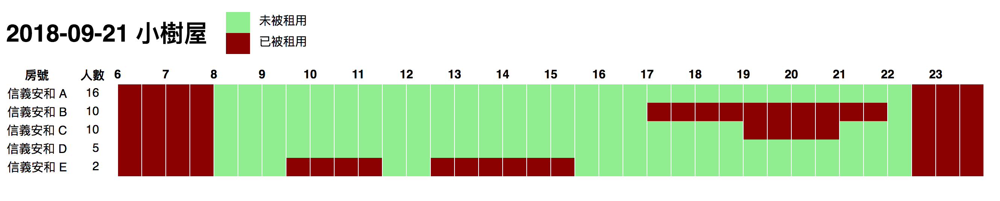

# Treerful Scanner / 小樹屋掃描器

找出特定日期所有小樹屋的時間表

## Installation / 安裝

```sh
gem install treerful_scanner
```

## Usage / 使用

```
Usage: treerful_scanner [options]
    -d, --date DATE                  yyyy-mm-dd
    -n, --place-names x,y,z          Filter by place names
    -p, --places x,y,z               Filter by place IDs
    -f, --format FORMAT              "terminal" (default), "html", "png"
```

## Example / 範例

### Plain Text

* `O` 表示尚未出租的時段

```
$ treerful_scanner -n 信義安和 -d 2018-09-21 -format terminal
2018-09-21          6   7   8   9   10  11  12  13  14  15  16  17  18  19  20  21  22  23
信義安和 A                  O O O O O O O O O O O O O O O O O O O O O O O O O O O O O
信義安和 B                  O O O O O O O O O O O O O O O O O O                     O
信義安和 C                  O O O O O O O O O O O O O O O O O O O O O O         O O O
信義安和 D                  O O O O O O O O O O O O O O O O O O O O O O O O O O O O O
信義安和 E                  O O O         O O             O O O O O O O O O O O O O O
```

### HTML

```
$ treerful_scanner -n 信義安和 -d 2018-09-21 -format html
```

